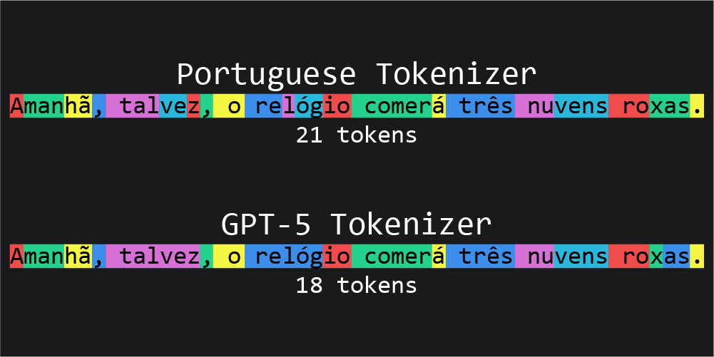

# Portuguese Tokenizer

A tokenizer is the component that breaks raw text into smaller units — tokens — that a language model can process, whether those are whole words, subwords, or individual characters. The vocabulary and splitting rules a tokenizer uses directly affect how efficiently a model can represent text, which is why general-purpose tokenizers (like those built for GPT models) are trained on massive, multilingual datasets and often handle non-English languages, including Portuguese, less efficiently than they could.

This project is a tokenizer built specifically for Portuguese. I focused on a single language for two reasons: Portuguese is my native language, so I have the linguistic intuition to evaluate and refine it properly, and narrowing the scope to one language makes it possible to reach higher tokenization efficiency than a general-purpose, multilingual tokenizer can achieve. By training exclusively on Portuguese text, the vocabulary can better capture the language's morphology, common word patterns, and orthography, resulting in fewer tokens per sentence and more efficient downstream processing.

You can see the tokenizer running live at **[link the site]**. The image below compares its performance against a standard GPT-5 tokenizer, showing the difference in token count for equivalent Portuguese text:



## How It Works

- **Data prep** — Portuguese text is pulled from a dataset and concatenated into one large training corpus.
- **Evaluation (optional but recommended)** — token-efficiency is measured across different merge counts to pick a vocabulary size that balances compression against memory footprint. `3500` merges was chosen as the sweet spot for this project.
- **Training** — a byte-pair encoding (BPE) style algorithm iteratively merges the most frequent adjacent token pairs into a final vocabulary, with custom rules that prevent merges across punctuation or newlines.
- **Inference** — the trained vocabulary is loaded and used to tokenize new text via a "longest match" algorithm, available both as a CLI demo and a Streamlit web app.

For the full step-by-step breakdown (scripts, methods, and internals), see [`docs/ARCHITECTURE.md`](https://claude.ai/docs/ARCHITECTURE.md).

## Tech Stack

- Python
- Streamlit (web demo)

## Installation

```bash
git clone https://github.com/rdAraujoV/portuguese-tokenizer.git
cd your-repo
pip install -r requirements.txt
```

## Usage

**Command-line demo:**

```bash
python demo.py
```

Prints a color-coded visualization of how your input text is tokenized.

**Web app:**

```bash
streamlit run app.py
```

Paste text into the browser UI to see the tokenization, total token count, and raw token IDs.

## Roadmap

This tokenizer is a building block for a larger Small Language Model (SLM) project I'm developing for Portuguese.
